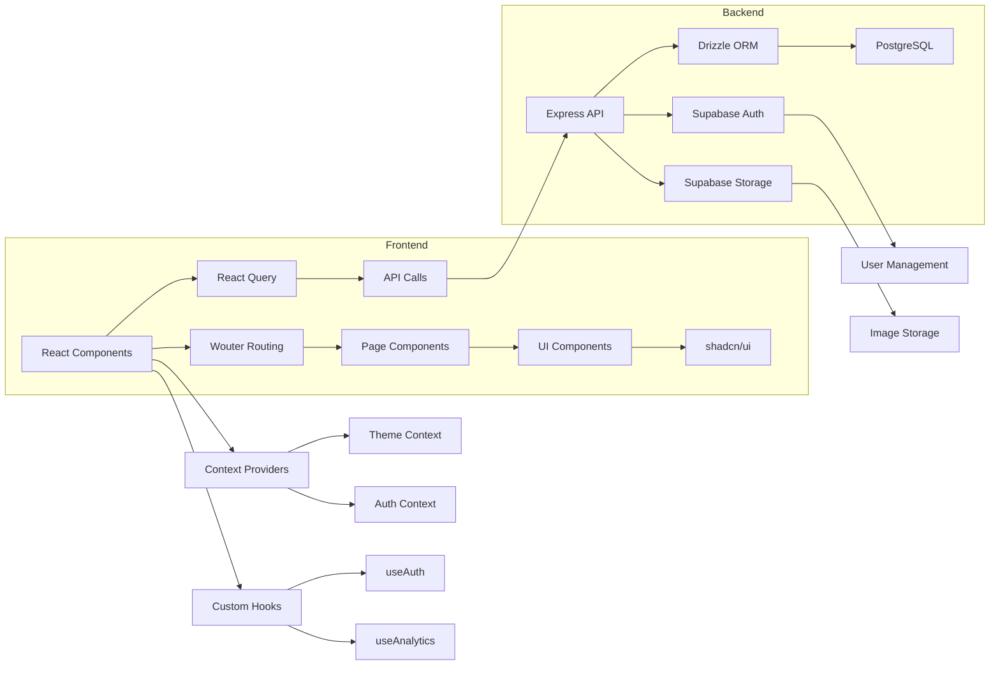

# CLAUDE.md

This file provides guidance to Claude Code (claude.ai/code) when working with code in this repository.

## 🤖 SPECIALIZED AGENTS - USE PROACTIVELY

**⚠️ IMPORTANT: These specialist agents MUST be used for their respective domains. Don't attempt complex tasks in these areas without consulting the appropriate specialist first.**

Available in root directory:
- **`auth-security-specialist.md`** - Authentication, security, privacy, user management
- **`backend-specialist.md`** - Express.js, Node.js, PostgreSQL, Drizzle ORM, API development
- **`css-specialist.md`** - Styling, design system, fonts, colors, component consistency
- **`database-specialist.md`** - PostgreSQL queries, schema design, performance optimization
- **`frontend-specialist.md`** - React/TypeScript, components, responsive design, performance
- **`gallery-specialist.md`** - Image management, gallery systems, client access, visual presentation
- **`seo-marketing-specialist.md`** - SEO optimization, meta tags, marketing pages, conversions
- **`meta-agent-updater.md`** - Updates all agents based on learnings and development patterns

**Usage Pattern**: Use the Task tool with the appropriate `subagent_type` parameter. These agents should be used PROACTIVELY - don't wait for the user to request them. If working on gallery features → use gallery-specialist, styling issues → use css-specialist, etc.

## 🚨 CRITICAL DEVELOPMENT RULES

**⚠️ MANDATORY: NO ALBUM-SPECIFIC OR ID-SPECIFIC CODE MODIFICATIONS**

When working on dynamic gallery pages or any dynamic content system:

- **NEVER** target specific albums, IDs, slugs, or individual records in conditional logic
- **NEVER** use conditions like `if (albumSlug === 'specific-album')` or similar targeting
- **ALWAYS** work on the universal, dynamic code that affects ALL records equally
- **If experimenting with a single record is needed:**
  1. Clearly state it's a temporary experiment
  2. Immediately roll the solution back to universal code once identified
  3. Never leave album-specific conditions in the codebase

**Example of FORBIDDEN patterns:**
```javascript
// ❌ NEVER DO THIS
if (shoot?.customSlug === 'aloe') { /* special handling */ }
if (album.id === 'specific-id') { /* different logic */ }
```

**Example of CORRECT patterns:**
```javascript
// ✅ ALWAYS DO THIS
if (images.length > 12) { /* universal logic based on data characteristics */ }
if (gallerySettings?.layoutStyle === 'masonry') { /* universal logic based on settings */ }
```

This rule prevents maintenance nightmares, ensures consistent user experience, and maintains system scalability.

**⚠️ MANDATORY: ALWAYS consult [`DEV_SERVER_STARTUP.md`](./DEV_SERVER_STARTUP.md) BEFORE attempting to start the development server or troubleshoot startup issues.**

This project uses Docker for development. Do NOT use `npm run dev` directly - it will fail.

## Development Commands

**Primary Development (REQUIRED):**
- `npm run docker:dev` - **ONLY correct way to start development environment**
- `docker-compose --profile dev up adminer -d` - **Start database admin interface (Adminer)**

**Other Commands:**
- `npm run build` - Build for production (Vite client + esbuild server bundle)
- `npm run start` - Start production server (runs built application)
- `npm run check` - Run TypeScript type checking
- `npm run db:push` - Push database schema changes with Drizzle

**📋 For complete development setup instructions, see:** [`DEV_SERVER_STARTUP.md`](./DEV_SERVER_STARTUP.md)
- **File structure & storage configuration** (Dropbox vs local)
- Cross-platform setup guide (macOS, Windows, Linux)
- Docker storage optimization and cleanup
- Port conflict resolution  
- Device switching workflow
- Troubleshooting and emergency recovery
- Quick reference commands

## 🔧 Development Startup Checklist

Before any development work:
1. ✅ Read [`DEV_SERVER_STARTUP.md`](./DEV_SERVER_STARTUP.md)
2. ✅ Ensure Docker Desktop is running
3. ✅ Use `npm run docker:dev` (never `npm run dev`)
4. ✅ Start Adminer for database access: `docker-compose --profile dev up adminer -d`
5. ✅ Verify http://localhost:3000 responds with HTTP 200 OK
6. ✅ Verify http://localhost:8080 shows Adminer interface

**⚠️ ARM-based Apple Silicon Note (M1/M2/M3 Macs):**
- Docker containers automatically build for both ARM64 and AMD64 architectures
- No special steps required - the multi-platform build handles compatibility
- Expect slightly longer initial build times compared to Intel Macs
- Total local storage requirement: ~1.1GB (see DEV_SERVER_STARTUP.md for breakdown)

## Architecture Overview

This is a full-stack photography studio website (SlyFox Studios) built with modern web technologies:

### Technology Stack
- **Frontend**: React 18 + TypeScript + Vite
- **Backend**: Express.js + Node.js
- **Database**: PostgreSQL with Drizzle ORM
- **Authentication**: Supabase Auth
- **Storage**: Supabase Storage for images
- **Styling**: Tailwind CSS + shadcn/ui components
- **Routing**: Wouter (client-side)

### Project Structure
- `client/` - React frontend application
- `server/` - Express.js backend API
- `shared/` - Shared TypeScript schemas and types (Zod validation)
- `public/` - Static assets (images, videos)

### Key Architecture Patterns

**Build System**:
- Development uses Vite dev server with API proxy to Express backend
- Production builds client to `dist/public` and server to `dist/index.js`
- Single Express server serves both API routes and static files in production
- All services run on port 3000 in both development and production

**Database Schema** (`shared/schema.ts`):
- `profiles` - User accounts (Supabase auth integration, primary user table)
- `clients` - Client management with email-based matching
- `shoots` - Photography session metadata with customization options
- `images` - Image files and metadata with sequence ordering
- `packages` - Service packages and pricing
- `analytics` - User interaction tracking

**Authentication Architecture**:
- Supabase Auth for user management with role-based access control
- Server-side auth verification using Supabase admin client
- Role hierarchy: `client` (gallery access) → `staff` (content management) → `super_admin` (full access)
- Mock auth fallback for development without full Supabase setup

**Frontend Architecture**:
- Component organization: `admin/`, `auth/`, `client/`, `common/`, `gallery/`, `layout/`, `sections/`, `shared/`, `ui/`
- Context providers for theme and authentication state
- React Query for server state management
- Wouter for client-side routing
- Path aliases: `@/` (client src), `@shared/` (shared schemas), `@assets/` (attached assets)

**Backend Architecture**:
- Express routes with comprehensive API endpoints for auth, clients, shoots, images
- Multer for file upload handling (10MB limit, images only)
- Request/response logging middleware for API calls
- Supabase integration for both auth and storage operations
- Database seeding and admin initialization utilities

### Component Structure Analysis

**Component Organization**:
- Components are organized by feature: `admin/`, `common/`, `gallery/`, `layout/`, `sections/`, `shared/`, `ui/`
- UI components follow a consistent pattern with variants managed by class-variance-authority (cva)
- Card components use composition pattern (Header, Title, Description, Content, Footer)
- Navigation components implement responsive design with mobile/desktop variations

**Gallery Components Architecture**:
- `GalleryRenderer` - Unified rendering component supporting 8 layout modes with dynamic aspect ratio detection
- `GallerySettingsCard` - Modular settings panel with real-time preview integration
- Layout modes: Automatic, Square 1:1, Portrait 2:3, Landscape 3:2, Instagram 4:5, Upright 9:16, Wide 16:9, Masonry
- Automatic mode uses browser Image API to analyze collection and select optimal aspect ratio
- Real-time color picker with popover interface (non-blocking preview)
- Pixel-precise border radius and image spacing controls (0-40px range)

**Component Relationships**:
- Layout components (`Navigation`, `Footer`) wrap page content
- Page components compose multiple section components
- UI components (Button, Card, Dialog) are used throughout the application
- Admin components use tab-based navigation for different management areas
- Gallery settings provide real-time preview updates across all controls
- Modular gallery architecture allows independent component updates without affecting preview

### Routing Implementation

**Route Configuration**:
- Implemented in `client/src/App.tsx` using Wouter's `Switch` and `Route` components
- Static routes: `/`, `/photography`, `/videography`, `/about`, `/pricing`, `/contact`
- Dynamic routes: 
  - `/photography/:category` - Photography category pages
  - `/videography/:category` - Videography category pages
  - `/gallery/:slug` - Client gallery pages
- Authentication routes: `/login`, `/dashboard`, `/client-portal`, `/admin`

**Route Handling**:
- Parameterized routes use `useParams` hook to access route parameters
- Gallery route uses render prop pattern to pass `shootId` to `ClientGallery` component
- Protected routes redirect based on user authentication state
- Admin routes have role-based access control

### State Management

**Context Providers**:
- `ThemeContext` (client/src/contexts/theme-context.tsx):
  - Manages dark/light theme preference
  - Persists theme selection to localStorage
  - Provides `theme` state and `toggleTheme` function
  - Applied to document element for CSS styling

- `AuthProvider` (client/src/hooks/use-auth.tsx):
  - Manages user authentication state
  - Handles login/logout functionality
  - Persists user session to localStorage
  - Provides role-based access control
  - Integrates with Supabase Auth (mocked in development)

### Custom Hooks

**Key Hooks**:
- `useAuth` (client/src/hooks/use-auth.tsx):
  - Provides authentication state and methods
  - Handles user session management
  - Implements role-based access control

- `useAnalytics` (client/src/hooks/use-analytics.tsx):
  - Tracks page views using Google Analytics
  - Listens to route changes via `useLocation`
  - Prevents duplicate tracking for same route

- `useScrollToTop` (client/src/hooks/use-scroll-to-top.tsx):
  - Scrolls to top of page on route change
  - Uses `useLocation` to detect navigation events

- `useToast` (client/src/hooks/use-toast.ts):
  - Manages toast notifications
  - Implements queue system with dismissal timeout
  - Provides consistent notification experience

- `useMobile` (client/src/hooks/use-mobile.tsx):
  - Detects mobile viewport size
  - Uses window.matchMedia for responsive behavior
  - Returns boolean indicating mobile state

### UI Component Library

**Implementation Details**:
- Built on shadcn/ui component library with Radix UI primitives
- Uses class-variance-authority (cva) for variant management
- Components follow consistent composition patterns
- Tailwind CSS with custom theme configuration

**Key Components**:
- `Button` (client/src/components/ui/button.tsx):
  - Multiple variants (default, destructive, outline, secondary, ghost, link)
  - Multiple sizes (default, sm, lg, icon)
  - Uses cva for variant management
  - Supports asChild prop for component composition

- `Card` (client/src/components/ui/card.tsx):
  - Composition pattern with Header, Title, Description, Content, Footer
  - Consistent styling across the application
  - Used for data display and content organization

- `Dialog` (client/src/components/ui/dialog.tsx):
  - Modal implementation using Radix UI
  - Includes Header, Footer, Title, Description subcomponents
  - Handles accessibility and focus management

**Styling Approach**:
- Tailwind CSS with custom theme configuration
- Class variance authority (cva) for component variants
- CSS variables for theme colors
- Responsive design patterns throughout

### Data Fetching Patterns

**Data Fetching Architecture**:
- React Query for server state management
- Custom `apiRequest` utility for API calls
- Supabase integration for auth and storage
- Mock implementations for development

**Key Files**:
- `queryClient.ts` (client/src/lib/queryClient.ts):
  - Configures React Query client
  - Implements error handling with `throwIfResNotOk`
  - Sets default query options (staleTime, retry, etc.)
  - Provides `getQueryFn` for consistent data fetching

- `supabase.ts` (client/src/lib/supabase.ts):
  - Mock implementation of Supabase client
  - Handles authentication (signIn, signUp, signOut)
  - Manages user roles (client, staff)
  - Will be replaced with real Supabase integration

**Data Flow**:
- Page components use `useQuery` for data fetching
- API routes handle database operations via Drizzle ORM
- Supabase manages authentication and image storage
- React Query handles caching, refetching, and state management

### Application Architecture Diagram



### Environment Configuration
Required environment variables:
- `DATABASE_URL` - PostgreSQL connection string
- `VITE_SUPABASE_URL` - Supabase project URL
- `VITE_SUPABASE_ANON_KEY` - Supabase anonymous key
- `SUPABASE_SERVICE_ROLE_KEY` - Supabase service role key for admin operations

## Production Deployment

### VPS Configuration
- **Server**: vps.netfox.co.za (168.231.86.89)
- **OS**: Ubuntu 24.04 LTS
- **Resources**: 3.8GB RAM, 1 CPU core, 48GB storage
- **Provider**: Hostinger

### Deployment Architecture
The application is deployed on a VPS alongside N8N automation platform:

**Applications Running:**
- **SlyFox Studios** (this app): Port 3000 → http://168.231.86.89:3000
- **N8N Automation**: Port 5678 → http://168.231.86.89:5678

**Infrastructure Services:**
- **Traefik Reverse Proxy**: Ports 80/443 (SSL termination, HTTP→HTTPS redirect)
- **PostgreSQL**: Port 5432 (SlyFox database)

### Production File Structure
```
VPS Locations:
/opt/sfweb/              # Main application deployment
├── docker-compose.yml   # Production Docker setup
├── .env                 # Production environment variables
└── [project files]      # Complete application codebase

/root/                   # N8N + Traefik configuration
├── docker-compose.yml   # Traefik + N8N setup
├── .env                 # N8N environment variables
└── traefik-certs.yml    # SSL certificate configuration
```

### Production Commands
```bash
# Deploy/update SlyFox application
cd /opt/sfweb
docker-compose up -d --build

# Monitor application
docker logs sfweb-app --tail 20
docker stats --no-stream

# Database access
docker-compose exec postgres psql -U postgres -d slyfox_studios
```

### Domain Configuration
- **Target Domain**: slyfox.co.za (A record pending)
- **Current Access**: http://168.231.86.89:3000
- **SSL**: Automatic Let's Encrypt certificates via Traefik

### Version Control & Deployment
- **Repository**: https://github.com/fatthwacka/sfweb.git
- **Local Development**: Dockerized setup syncs via Dropbox across Intel/ARM devices  
- **Production Deployment**: Direct Docker deployment on VPS
- **Code Synchronization**: Git-based deployment to VPS from development environment

### Key Features
- **Advanced Gallery Management**: 8 layout modes with intelligent automatic aspect ratio detection
- **Real-time Gallery Customization**: Live preview with pixel-precise controls (border radius, spacing: 0-40px)
- **Smart Layout Detection**: Browser-based image analysis for optimal aspect ratio selection
- **Non-blocking Color Picker**: Popover-based color selection with real-time background preview
- **Unified Gallery Architecture**: Modular components supporting both admin and client rendering modes
- **Consistent Responsive Design**: Identical breakpoints across all layout modes (2-3-4-5 columns)
- **Precise Masonry Layout**: Accurate gap control matching slider settings exactly
- **Comprehensive Site Management**: Centralized admin interface for all website content
- **Dynamic Content Configuration**: Hero slides, company info, and page settings management
- **Visual Content Editing**: Drag-and-drop image uploads with thumbnail management
- **Real-time Configuration**: Changes reflect immediately across all pages
- **Image upload, organization, and sequence management**
- **SEO-optimized gallery URLs with slug-based routing**
- **Analytics tracking for user interactions**
- **Mobile-responsive design with theme switching**
- **Admin dashboard for comprehensive content management**
- **Real-time image processing and storage via Supabase**
- **Enhanced Scroll Behavior**: Automatic scroll-to-top with browser restoration disabled

## Gallery System Architecture

### Layout Modes (8 Total)
1. **Automatic** - Analyzes image collection using browser Image API to determine most common aspect ratio
2. **Square 1:1** - Forces all images to square aspect ratio (`aspect-square`)
3. **Portrait 2:3** - Standard portrait photography ratio (`aspect-[2/3]`)
4. **Landscape 3:2** - Classic landscape photography ratio (`aspect-[3/2]`)
5. **Instagram 4:5** - Social media optimized portrait (`aspect-[4/5]`)
6. **Upright 9:16** - Vertical video/mobile format (`aspect-[9/16]`)
7. **Wide 16:9** - Cinematic/widescreen format (`aspect-[16/9]`)
8. **Masonry** - Pinterest-style layout preserving natural image ratios

### Automatic Mode Intelligence
```javascript
// Analyzes up to 10 images for performance
// Categorizes into specific aspect ratio buckets:
// - Square: 0.9-1.1 ratio
// - Portrait 2:3: 0.6-0.7 ratio  
// - Landscape 3:2: 1.4-1.6 ratio
// - Instagram 4:5: 0.75-0.85 ratio
// - And more specific ranges...
// Returns the most frequent ratio as CSS class
```

### Gallery Settings Controls
- **Layout Style**: Dropdown with 8 modes, defaults to Automatic
- **Background Color**: Real-time color picker with 5 presets + custom popover
- **Border Radius**: 0-40px slider with inline numeric input
- **Image Spacing**: 0-40px slider matching border radius interface
- **All controls**: Unified `.gallery-slider-container` styling with dark purple gradients

### CSS Architecture
```css
/* Reusable slider container styling */
.gallery-slider-container {
  background: linear-gradient(to right, hsl(280, 60%, 15%), hsl(280, 50%, 10%));
  border: 1px solid hsl(280, 50%, 20%);
  /* Consistent styling for all gallery controls */
}

/* Color picker swatches */
.color-swatch {
  flex: 1; /* Full-width spanning */
  border-radius: 0.25rem; /* Square with rounded corners */
  border: 1px solid hsl(280, 50%, 20%); /* Matching container border */
}

/* Masonry precision spacing */
.masonry-item {
  vertical-align: top;
  break-inside: avoid;
  /* Ensures precise gap control */
}
```

### Performance Optimizations
- **Dynamic Dimension Loading**: Browser Image API reads actual file dimensions (no database required)
- **Smart Sampling**: Automatic mode analyzes first 10 images only
- **Parallel Loading**: Concurrent dimension requests with Promise.all()
- **Real-time Updates**: All controls update live preview immediately
- **Graceful Fallbacks**: Defaults to square while dimensions load

### Browser Compatibility
- **Scroll Restoration**: Disabled via `history.scrollRestoration = 'manual'`
- **Image API**: Uses native `Image()` constructor for dimension reading
- **CSS Grid/Columns**: Modern browser support for layout modes
- **Popover API**: Radix UI popover for non-blocking color picker

## Site Management System Architecture

### Configuration Management
The site management system provides a centralized approach to managing dynamic website content through an admin interface with real-time persistence and immediate updates across all pages.

**Core Components:**
- **Data Storage**: In-memory `configOverrides` with future PostgreSQL migration
- **API Layer**: RESTful endpoints (`/api/site-config`, `/api/site-config/bulk`) 
- **Admin Interface**: Role-based management panels with visual editing
- **File Upload System**: Direct image upload with automatic path integration
- **Real-time Sync**: Changes reflect immediately across all consuming pages

**Architecture Documentation:**
- **📋 Complete Implementation Guide**: [`SITE_MANAGEMENT_ARCHITECTURE.md`](./SITE_MANAGEMENT_ARCHITECTURE.md)
  - Data flow patterns and persistence mechanisms
  - Configuration structure and API integration
  - Frontend/backend abstraction layers
  - Error handling and recovery strategies
  - Performance optimization and security considerations

- **🚨 CRITICAL API Reference**: [`SITE_CONFIG_API_METHODS.md`](./SITE_CONFIG_API_METHODS.md)
  - **REQUIRED: PATCH method for all site config updates**
  - Correct API usage examples and common mistakes
  - Server endpoint specifications and testing commands
  - Migration guide from POST to PATCH method

- **🤖 Site Management Specialist Agent**: [`site-management-specialist.md`](./site-management-specialist.md)
  - Expert agent for site configuration governance
  - Component development patterns and best practices
  - Common issue resolution and debugging guide
  - Extension guidelines and migration strategies

**Key Implementation Details:**
```typescript
// Configuration Structure
interface SiteConfig {
  contact: BusinessInfo & ContactMethods;
  home: {
    hero: { slides: HeroSlide[]; autoAdvance: boolean; };
    servicesOverview: ServicesConfiguration;
    testimonials: TestimonialsSection;
  };
}

// Admin Component Integration  
<HomepageSettings />  // Hero slides, company info management
<ContactSettings />   // Business details, contact methods

// Data Flow: Admin → API → Memory → All Pages
saveMutation.mutate(config) → configOverrides → deepMerge(defaults, overrides)
```

**Management Interface Features:**
- **Visual Thumbnail Management**: 80px image previews with drag-and-drop upload
- **Hero Slide Management**: Add/remove/reorder with up/down controls  
- **Real-time Validation**: Unsaved changes tracking with visual indicators
- **Company Information**: Business details, contact info, address management
- **File Upload Integration**: POST `/api/upload` with automatic path updates