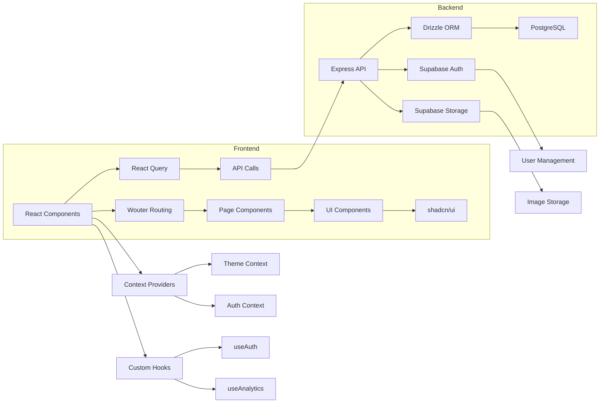

# CLAUDE.md

This file provides guidance to Claude Code (claude.ai/code) when working with code in this repository.

## Development Commands

- `npm run dev` - Start development server with hot reload using tsx
- `npm run build` - Build for production (Vite client + esbuild server bundle)
- `npm run start` - Start production server (runs built application)
- `npm run check` - Run TypeScript type checking
- `npm run db:push` - Push database schema changes with Drizzle

## Architecture Overview

This is a full-stack photography studio website (SlyFox Studios) built with modern web technologies:

### Technology Stack
- **Frontend**: React 18 + TypeScript + Vite
- **Backend**: Express.js + Node.js
- **Database**: PostgreSQL with Drizzle ORM
- **Authentication**: Supabase Auth
- **Storage**: Supabase Storage for images
- **Styling**: Tailwind CSS + shadcn/ui components
- **Routing**: Wouter (client-side)

### Project Structure
- `client/` - React frontend application
- `server/` - Express.js backend API
- `shared/` - Shared TypeScript schemas and types (Zod validation)
- `public/` - Static assets (images, videos)

### Key Architecture Patterns

**Build System**:
- Development uses Vite dev server with API proxy to Express backend
- Production builds client to `dist/public` and server to `dist/index.js`
- Single Express server serves both API routes and static files in production
- All services run on port 3000 in both development and production

**Database Schema** (`shared/schema.ts`):
- `profiles` - User accounts (Supabase auth integration, primary user table)
- `clients` - Client management with email-based matching
- `shoots` - Photography session metadata with customization options
- `images` - Image files and metadata with sequence ordering
- `packages` - Service packages and pricing
- `analytics` - User interaction tracking

**Authentication Architecture**:
- Supabase Auth for user management with role-based access control
- Server-side auth verification using Supabase admin client
- Role hierarchy: `client` (gallery access) → `staff` (content management) → `super_admin` (full access)
- Mock auth fallback for development without full Supabase setup

**Frontend Architecture**:
- Component organization: `admin/`, `auth/`, `client/`, `common/`, `gallery/`, `layout/`, `sections/`, `shared/`, `ui/`
- Context providers for theme and authentication state
- React Query for server state management
- Wouter for client-side routing
- Path aliases: `@/` (client src), `@shared/` (shared schemas), `@assets/` (attached assets)

**Backend Architecture**:
- Express routes with comprehensive API endpoints for auth, clients, shoots, images
- Multer for file upload handling (10MB limit, images only)
- Request/response logging middleware for API calls
- Supabase integration for both auth and storage operations
- Database seeding and admin initialization utilities

### Component Structure Analysis

**Component Organization**:
- Components are organized by feature: `admin/`, `common/`, `gallery/`, `layout/`, `sections/`, `shared/`, `ui/`
- UI components follow a consistent pattern with variants managed by class-variance-authority (cva)
- Card components use composition pattern (Header, Title, Description, Content, Footer)
- Navigation components implement responsive design with mobile/desktop variations

**Component Relationships**:
- Layout components (`Navigation`, `Footer`) wrap page content
- Page components compose multiple section components
- UI components (Button, Card, Dialog) are used throughout the application
- Admin components use tab-based navigation for different management areas

### Routing Implementation

**Route Configuration**:
- Implemented in `client/src/App.tsx` using Wouter's `Switch` and `Route` components
- Static routes: `/`, `/photography`, `/videography`, `/about`, `/pricing`, `/contact`
- Dynamic routes: 
  - `/photography/:category` - Photography category pages
  - `/videography/:category` - Videography category pages
  - `/gallery/:slug` - Client gallery pages
- Authentication routes: `/login`, `/dashboard`, `/client-portal`, `/admin`

**Route Handling**:
- Parameterized routes use `useParams` hook to access route parameters
- Gallery route uses render prop pattern to pass `shootId` to `ClientGallery` component
- Protected routes redirect based on user authentication state
- Admin routes have role-based access control

### State Management

**Context Providers**:
- `ThemeContext` (client/src/contexts/theme-context.tsx):
  - Manages dark/light theme preference
  - Persists theme selection to localStorage
  - Provides `theme` state and `toggleTheme` function
  - Applied to document element for CSS styling

- `AuthProvider` (client/src/hooks/use-auth.tsx):
  - Manages user authentication state
  - Handles login/logout functionality
  - Persists user session to localStorage
  - Provides role-based access control
  - Integrates with Supabase Auth (mocked in development)

### Custom Hooks

**Key Hooks**:
- `useAuth` (client/src/hooks/use-auth.tsx):
  - Provides authentication state and methods
  - Handles user session management
  - Implements role-based access control

- `useAnalytics` (client/src/hooks/use-analytics.tsx):
  - Tracks page views using Google Analytics
  - Listens to route changes via `useLocation`
  - Prevents duplicate tracking for same route

- `useScrollToTop` (client/src/hooks/use-scroll-to-top.tsx):
  - Scrolls to top of page on route change
  - Uses `useLocation` to detect navigation events

- `useToast` (client/src/hooks/use-toast.ts):
  - Manages toast notifications
  - Implements queue system with dismissal timeout
  - Provides consistent notification experience

- `useMobile` (client/src/hooks/use-mobile.tsx):
  - Detects mobile viewport size
  - Uses window.matchMedia for responsive behavior
  - Returns boolean indicating mobile state

### UI Component Library

**Implementation Details**:
- Built on shadcn/ui component library with Radix UI primitives
- Uses class-variance-authority (cva) for variant management
- Components follow consistent composition patterns
- Tailwind CSS with custom theme configuration

**Key Components**:
- `Button` (client/src/components/ui/button.tsx):
  - Multiple variants (default, destructive, outline, secondary, ghost, link)
  - Multiple sizes (default, sm, lg, icon)
  - Uses cva for variant management
  - Supports asChild prop for component composition

- `Card` (client/src/components/ui/card.tsx):
  - Composition pattern with Header, Title, Description, Content, Footer
  - Consistent styling across the application
  - Used for data display and content organization

- `Dialog` (client/src/components/ui/dialog.tsx):
  - Modal implementation using Radix UI
  - Includes Header, Footer, Title, Description subcomponents
  - Handles accessibility and focus management

**Styling Approach**:
- Tailwind CSS with custom theme configuration
- Class variance authority (cva) for component variants
- CSS variables for theme colors
- Responsive design patterns throughout

### Data Fetching Patterns

**Data Fetching Architecture**:
- React Query for server state management
- Custom `apiRequest` utility for API calls
- Supabase integration for auth and storage
- Mock implementations for development

**Key Files**:
- `queryClient.ts` (client/src/lib/queryClient.ts):
  - Configures React Query client
  - Implements error handling with `throwIfResNotOk`
  - Sets default query options (staleTime, retry, etc.)
  - Provides `getQueryFn` for consistent data fetching

- `supabase.ts` (client/src/lib/supabase.ts):
  - Mock implementation of Supabase client
  - Handles authentication (signIn, signUp, signOut)
  - Manages user roles (client, staff)
  - Will be replaced with real Supabase integration

**Data Flow**:
- Page components use `useQuery` for data fetching
- API routes handle database operations via Drizzle ORM
- Supabase manages authentication and image storage
- React Query handles caching, refetching, and state management

### Application Architecture Diagram

### Environment Configuration
Required environment variables:
- `DATABASE_URL` - PostgreSQL connection string
- `VITE_SUPABASE_URL` - Supabase project URL
- `VITE_SUPABASE_ANON_KEY` - Supabase anonymous key
- `SUPABASE_SERVICE_ROLE_KEY` - Supabase service role key for admin operations

### Key Features
- Client gallery management with customizable themes and layouts
- Image upload, organization, and sequence management
- SEO-optimized gallery URLs with slug-based routing
- Analytics tracking for user interactions
- Mobile-responsive design with theme switching
- Admin dashboard for comprehensive content management
- Real-time image processing and storage via Supabase