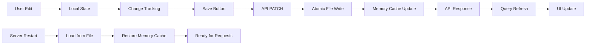

# Site Management Architecture

## Overview

The SlyFox Studios site management system provides a centralized approach to managing dynamic website content through an admin interface. This document outlines the complete implementation model, data abstraction layers, persistence mechanisms, and data flow patterns.

## Architecture Components

### 1. Data Storage & Persistence

**Configuration Storage:**
- **Primary Storage**: Atomic file persistence at `server/data/site-config-overrides.json`
- **In-Memory Cache**: `configOverrides` object for fast access
- **Server Startup**: Automatic restoration from persistent file
- **API Endpoints**: `/api/site-config` (GET), `/api/site-config/bulk` (PATCH)
- **Implementation**: `server/site-config-api.ts`

**Atomic Write System:**
```typescript
async function saveConfigOverrides(overrides: any): Promise<void> {
  const tempPath = `${CONFIG_OVERRIDES_PATH}.tmp.${Date.now()}`;
  
  // Write to temporary file first
  await fs.writeFile(tempPath, JSON.stringify(overrides, null, 2));
  
  // Atomic rename (guaranteed by OS)
  await fs.rename(tempPath, CONFIG_OVERRIDES_PATH);
}
```

**Configuration Structure:**
```typescript
interface SiteConfig {
  contact: {
    business: BusinessInfo;
    methods: ContactMethod[];
    hours: BusinessHours;
    responseTimes: ResponseTimes;
    serviceAreas: ServiceAreas;
    emergency: EmergencyContact;
  };
  home: {
    hero: {
      slides: HeroSlide[];
      autoAdvance: boolean;
      interval: number;
      effects: string[];
    };
    servicesOverview: ServicesOverview;
    testimonials: TestimonialsSection;
  };
}
```

### 2. Admin Interface Layer

**Component Structure:**
```
client/src/components/admin/page-settings/
├── homepage-settings.tsx     # Homepage content management
├── contact-settings.tsx      # Contact information management  
└── [future components]       # Additional page settings
```

**Integration Points:**
- **Parent Component**: `admin-content.tsx`
- **Access Control**: Role-based (staff/super_admin required)
- **Navigation**: Tab-based interface in Admin panel → Site Management

### 3. Data Abstraction Model

**Frontend Data Flow:**
1. **Query Phase**: React Query fetches current config via GET `/api/site-config`
2. **Edit Phase**: Local state management with change tracking
3. **Validation Phase**: Real-time form validation with visual feedback
4. **Save Phase**: Bulk update via PATCH `/api/site-config/bulk`
5. **Sync Phase**: Query invalidation triggers data refresh

**Data Transformation:**
```typescript
// API Response → Component State
const { data: siteConfig } = useQuery(['site-config'], fetchSiteConfig);
const [config, setConfig] = useState<SiteConfig>(siteConfig);

// Component State → API Request  
const saveMutation = useMutation({
  mutationFn: (newConfig: SiteConfig) => 
    fetch('/api/site-config/bulk', {
      method: 'PATCH',
      body: JSON.stringify(newConfig) // Direct config object
    })
});
```

## Implementation Details

### 4. Homepage Settings Implementation

**Component Features:**
- **Visual Thumbnail Management**: 80px image previews with drag-and-drop upload
- **Hero Slide Management**: Add/remove/reorder with up/down controls
- **Real-time Validation**: Unsaved changes tracking with visual indicators
- **File Upload Integration**: Direct file upload with automatic path updates
- **Company Information**: Business details, contact info, and address management

**File Upload System:**
- **Endpoint**: POST `/api/upload`
- **Storage**: `public/uploads/` directory (timestamped filenames)
- **Integration**: Automatic path updates in slide configuration
- **File Handling**: 10MB limit, image types only, unique naming

**Data Persistence Flow:**


### 5. Configuration Management

**Default Configuration:**
- **Source**: Hard-coded defaults in `site-config-api.ts`
- **Fallback Strategy**: Graceful degradation with minimal config
- **Override System**: In-memory overrides merged with defaults

**Deep Merge Strategy:**
```typescript
function deepMerge(target: any, source: any): any {
  // Recursively merges source into target
  // Arrays are replaced, objects are merged
  // Null/undefined handling with fallbacks
}

const mergedConfig = deepMerge(defaultConfig, configOverrides);
```

## Data Flow Patterns

### 6. Request/Response Cycle

**GET /api/site-config:**
```typescript
// 1. Load default configuration
const defaultConfig = { /* hardcoded defaults */ };

// 2. Apply any overrides  
const mergedConfig = deepMerge(defaultConfig, configOverrides);

// 3. Return merged configuration
res.json(mergedConfig);
```

**PATCH /api/site-config/bulk:**
```typescript
// 1. Receive configuration update
const updates = req.body; // Complete or partial config

// 2. Merge with existing overrides
const newOverrides = deepMerge(configOverrides, updates);

// 3. Save to disk atomically
await saveConfigOverrides(newOverrides);

// 4. Update in-memory cache after successful disk write
configOverrides = newOverrides;

// 5. Return success confirmation
res.json({ success: true, updatedFields: Object.keys(updates) });
```

### 7. Frontend Integration

**Homepage Usage:**
```typescript
// Pages that consume site configuration
const { data: siteConfig } = useQuery(['site-config'], fetchSiteConfig);

// Hero slider component
<HeroSlider 
  slides={siteConfig?.home?.hero?.slides}
  autoAdvance={siteConfig?.home?.hero?.autoAdvance}
  interval={siteConfig?.home?.hero?.interval}
/>

// Contact information
<ContactInfo business={siteConfig?.contact?.business} />
```

**Admin Panel Usage:**
```typescript
// Site management interface
<HomepageSettings />  // Full CRUD operations
<ContactSettings />   // Business info management
```

## Error Handling & Resilience

### 8. Failure Modes & Recovery

**File System Failure Recovery:**
- **Atomic Writes**: Prevent file corruption via temp file approach
- **Permission Errors**: Directory creation with recursive flag
- **Disk Space**: Graceful error handling with user notification
- **Temp File Cleanup**: Automatic cleanup on write failure

**API Failure Recovery:**
- **Fallback Config**: Minimal hardcoded configuration
- **File Read Errors**: Empty overrides fallback on startup
- **User Feedback**: Toast notifications for save failures  
- **Data Loss Prevention**: Unsaved changes warnings

**State Management:**
- **Write-then-Update**: Disk persistence before memory cache
- **Rollback Strategy**: Memory rollback on file write failure
- **Consistency Guarantee**: Atomic operations prevent partial writes
- **Server Restart Recovery**: Automatic state restoration

## Production Considerations

### 9. Persistence Architecture

**Current Implementation (File-Based):**
```typescript
// Startup: Load from persistent file
configOverrides = await loadConfigOverrides();

// Runtime: Atomic writes to disk
await saveConfigOverrides(newOverrides);

// Persistence: server/data/site-config-overrides.json
```

**Database Migration Path (Future):**
```typescript
// Migration: File → Database
const fileConfig = await fs.readFile(CONFIG_FILE);
const data = JSON.parse(fileConfig);
await db.insert(siteConfiguration).values({
  key: 'main',
  value: data
});
```

**Performance Optimization:**
- **Caching Strategy**: Redis/memory cache for frequently accessed config
- **Change Detection**: Only save modified fields
- **Compression**: Gzip compression for large configurations
- **CDN Integration**: Static asset optimization for uploaded images

## Security Considerations

### 10. Access Control

**Authentication Requirements:**
- **Role Validation**: Staff/super_admin roles required
- **Session Management**: JWT token validation
- **CSRF Protection**: Request origin validation
- **File Upload Security**: Type validation, size limits, path sanitization

**Data Validation:**
```typescript
// Server-side validation
const updateSchema = z.object({
  home: z.object({
    hero: z.object({
      slides: z.array(heroSlideSchema)
    })
  }).optional(),
  contact: contactSchema.optional()
});
```

## Monitoring & Debugging

### 11. Logging & Observability

**Request Logging:**
```typescript
console.log('Site config bulk update:', JSON.stringify(updates, null, 2));
console.log('Updated configOverrides:', JSON.stringify(configOverrides, null, 2));
```

**Performance Metrics:**
- **API Response Times**: Save operation duration
- **File Upload Times**: Image processing performance
- **Memory Usage**: Configuration object size tracking
- **Cache Hit Rates**: Configuration retrieval efficiency

## Extension Points

### 12. Future Enhancements

**Planned Features:**
- **Service Cards Management**: Dynamic service offering configuration
- **Testimonials Management**: Customer review system
- **SEO Settings**: Meta tags, structured data configuration
- **Theme Customization**: Color schemes, typography settings
- **Multi-language Support**: Internationalization configuration

**Integration Opportunities:**
- **Version Control**: Configuration change history
- **Approval Workflows**: Multi-stage content approval
- **A/B Testing**: Configuration variant management
- **Analytics Integration**: Content performance tracking

---

## Quick Reference

**Key Files:**
- `server/site-config-api.ts` - API endpoints and data persistence
- `client/src/components/admin/page-settings/homepage-settings.tsx` - Homepage management UI
- `client/src/components/admin/admin-content.tsx` - Admin panel integration
- `shared/schema.ts` - Type definitions and validation schemas

**API Endpoints:**
- GET `/api/site-config` - Retrieve current configuration
- PATCH `/api/site-config/bulk` - Update configuration (bulk)
- POST `/api/upload` - File upload for images

**Database Schema (Future):**
```sql
CREATE TABLE site_configuration (
  id SERIAL PRIMARY KEY,
  key VARCHAR(50) NOT NULL UNIQUE,
  value JSONB NOT NULL,
  updated_at TIMESTAMP DEFAULT NOW(),
  updated_by UUID REFERENCES profiles(id)
);
```